# Main Branch Protection

This is software that automatically protects the main branch of a GitHub organization. It is intended to be deployed as [Azure Functions](https://azure.microsoft.com/products/functions) and called from [Webhooks](https://docs.github.com/webhooks/about-webhooks).

## What it does

Once properly set up, the app does the following:

1. Automatically protect the main branch according to [BranchProtectionPolicy](./src/functions/api/BranchProtectionPolicy.ts).
2. Provide a protection summary in the Issue.

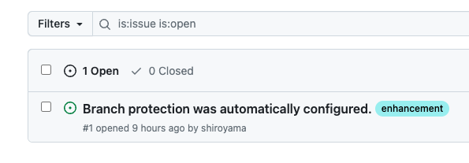

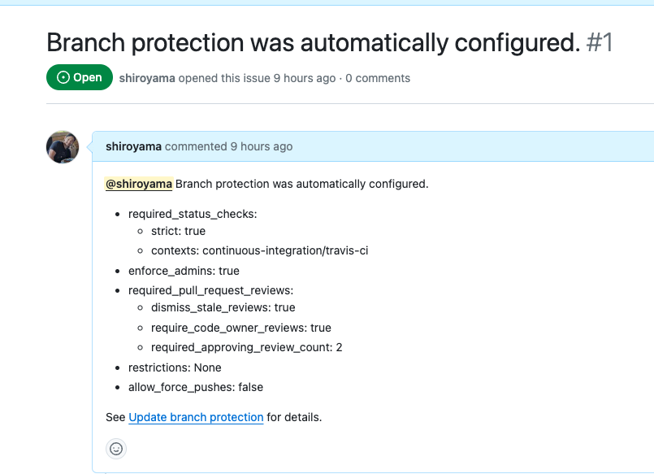

## Prerequisites

1. Valid Azure Subscription
2. GitHub account and organization

## Architecture

An overview of the architecture is shown in the following figure:

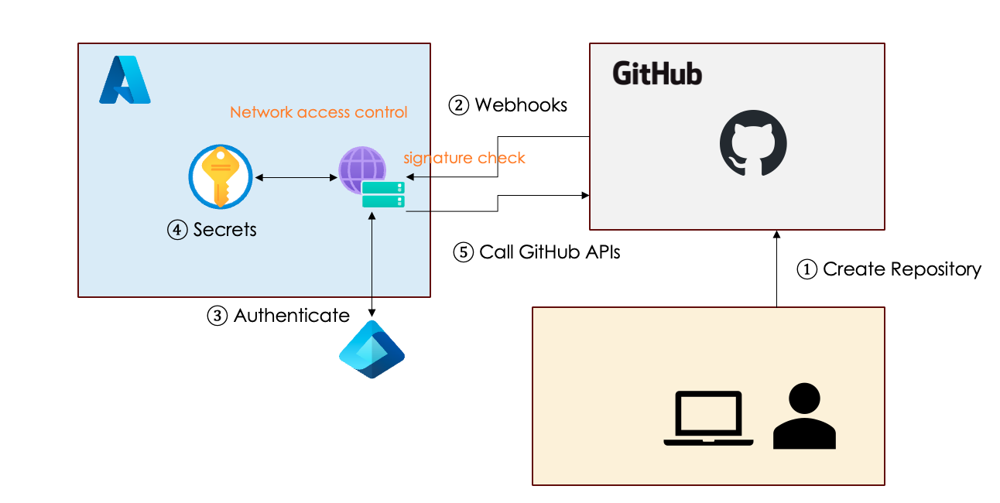

1. The user creates a new repository within the GitHub organization.
2. GitHub Webhooks notifies registered Azure Functions (this app) of an event that a repository has been created.
    1. At this time, Webhooks computes the signature of the payload using the Secret registered by the user in advance and sets it in the header.
    2. Azure Functions (this app) receives that event. At this time, the signature of the payload is calculated using the same Secret and compared with the signature set in the header. A match means that the payload has not been tampered with.
3. Azure Functions (this app) authenticates with Entra ID to retrieve secret, token and other confidential information from Key Vault.
4. After authentication, app can securely retrieves confidential information from the Key Vault.
5. Using this token, the app calls the GitHub APIs to protect the branch.

## Setup

Cloning this repository means you are ready to use it. This section provides step-by-step instructions for setting up to use this application.

### VSCode

1. Download and install [Visual Studio Code (VSCode)](https://code.visualstudio.com/).
2. Install Azure Functions extensions.
3. Sign in to Azure subscription from VSCode.

### GitHub - Personal Access Tokens (PAT)

Create a GitHub Personal Access Tokens (PAT) to call GitHub's API from the app.

1. Go to [Fine-grained personal access tokens](https://github.com/settings/tokens?type=beta) page.
2. Hit "Generate new token".
3. Change Resource owner to your organization.
4. Change Repository access to "All repositories".
5. Select Permissions:
    1. `Administration: Read and Write`
    2. `Issues: Read and Write`
6. Hit "Generate token" and keep it securely.

### Development environment

Here is an explanation of how to run this app from the development environment.

1. Rename `local.settings.json.example` to `local.settings.json`.
    1. Enter the token value you just generated in the `PAT_TOKEN: ""` section. This file is not version controlled, so don't worry about the security.
    2. `SIGNATURE_SECRET: ""` section will be entered later.
2. Press F5 to build and launch the app. The app should be available at `http://localhost:7071`
3. Install and start [Ngrok](https://ngrok.com/) so that Webhooks can reach this app from the Internet. `ngrok http 7071`

The `https://xxxx.ngrok-free.app` part is the public URL for this app.

**Important:** This app is configured to receive `POST` requests at `https://xxxx.ngrok-free.app/api/httpTrigger1`, so please note this URL.

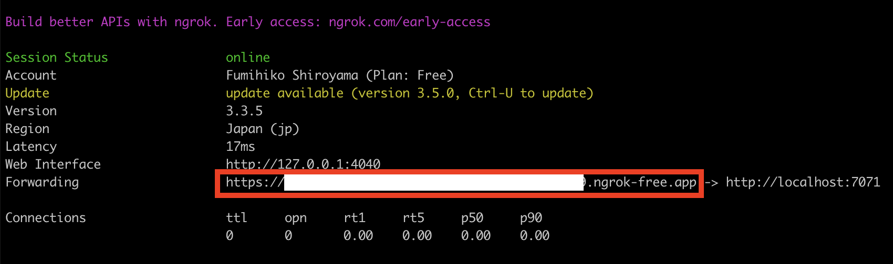

### GitHub - Webhooks

Now let's set up GitHub Webhooks.

1. Open Webhooks from the GitHub organization settings.
2. Hit "Add webhook".
3. Paste the earlier URL in the "Payload URL" section.
4. Change "Content type" to `application/json`.
5. Input Secret for signature validation. Keep this value securely.

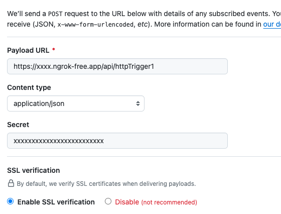

Next, select the events you would like to be notified about via Webhooks.

Change the trigger to "Let me select individual events".

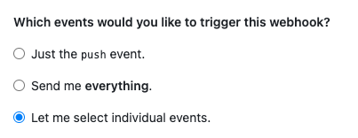

Then, select "Repositories" to receive events only related to repositories.

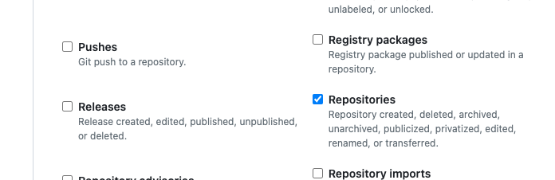

Finally, now that you have created your webhooks secret, don't forget to add this to `SIGNATURE_SECRET: ""` in `local.settings.json` in your development environment.

Now that everything is ready, create a new repository in your GitHub organization. Refresh the screen to see that the Issue has been created as expected.

### Production environment

Now that you have it working well in the development environment, let's deploy it to Azure Functions for the production environment.

#### Functions

First, set up [Azure Functions](https://azure.microsoft.com/products/functions). Serverless mode (pay-as-you-go) is fine.

Next, enable Managed ID to access Key Vault from Functions. Select "Identity" from "Settings".

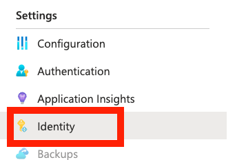

Enable System assigned ID.

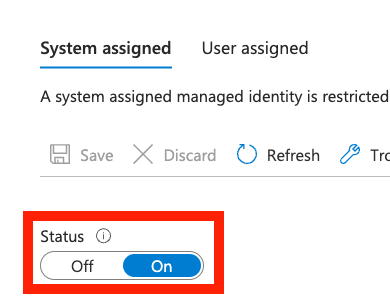

[Optional] Optionally, you can limit the network access to your function to GitHub Webhooks. This IP list can be found in "hooks" section from https://api.github.com/meta.

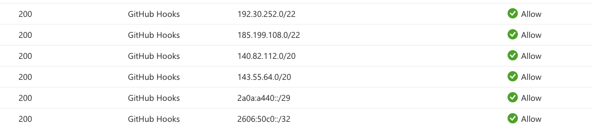

#### Key Vault

[Key Valuts](https://learn.microsoft.com/azure/key-vault/general/basic-concepts) is an Azure managed service that securely manages secrets, certificates, and other confidential information. We store GitHub PAT and signature secret here and use them from Functions.

Create a Key Vault with any name and note the Vault URI.

Select "Secret" and register a secret with the following name:
- `PatToken`: PAT that we generated earlier
- `SignatureSecret`: Secret that we specified in the Webhooks earlier

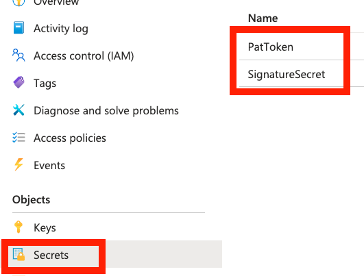

Next, set up Functions to have access to this Key Vault. Select "Access control (IAM)" and hit "Add role assignment".

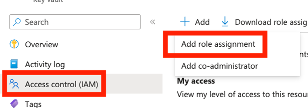

Next, choose a Role: "Key Vault Secrets User", which is the minimum role for Functions to see the secret.

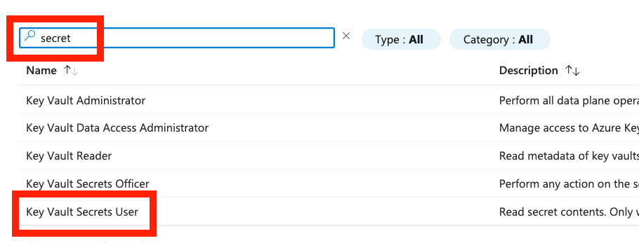

Choose "Managed identity" then hit "Select members".

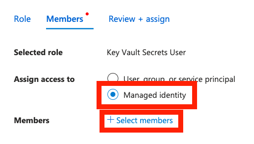

Select the Managed ID of the Function to assign the "Key Vault Secrets User" role.

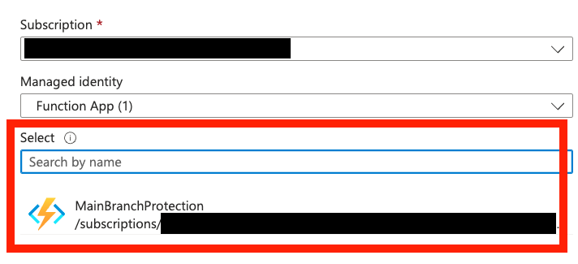

#### Deployment

Finally, deploy the app from VSCode to Functions.

Select your subscription from the Azure icon and deploy to Functions.

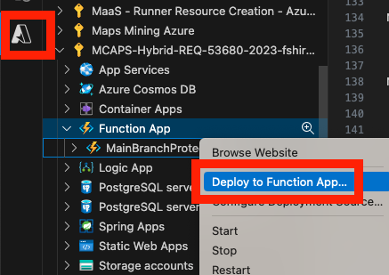

Finally, change the GitHub Webhooks URL to the Functions URL to confirm that it works, and you are done. Congratulations!